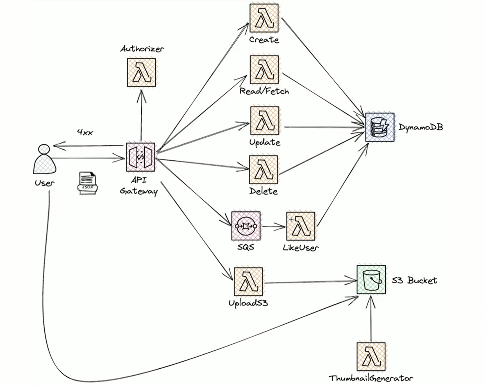

# Demo Serverless Framework

This project demonstrates the usage of Serverless Framework on AWS. Creating a RESTful API with AWS API Gateway, Lambdas, DynamoDB, S3 and SQS.

## Architecture
This image is from [Serverless Framework Advanced Course on Platzi](https://platzi.com/cursos/serverless-avanzado/)



## Prerequisites

Before deploying this service, make sure you have the following:
- An AWS account: `export AWS_PROFILE=<your profile>`
- Serverless Framework installed globally `npm install -g serverless`
- Node.js 18.x runtime installed
- Python 3.11 runtime installed (for one function)
- For packaging the lambda layer: `npm run layer`
- Optional: DynamoDB Local installed for local development

## Service Details

This service consists of several Lambda functions, an API Gateway, DynamoDB table, S3 bucket, and associated configurations.

- **Service Name:** demo-sam-apigw-dynamodb
- **Runtime:** Node.js 18.x
- **Stage:** dev

## IAM Permissions

The service requires the following IAM permissions:

- Access to DynamoDB operations (`dynamodb:*`) on a specific table.
- Access to S3 operations (`s3:*`) on a specific bucket.

## Environment Variables

- `BUCKET_NAME`: Name of the S3 bucket
- `REGION`: AWS region
- `SECRET`: Secret name
- `TABLE_NAME`: Name of the DynamoDB table

## Plugins

- `serverless-dynamodb`: Plugin for DynamoDB integration
- `serverless-offline`: Plugin for local development
- `serverless-apigateway-service-proxy`: Plugin for API Gateway service proxy
- `serverless-lift`: Plugin for Serverless Lift

## Functions

### 1. `custom-authorizer`

- **Handler:** `src/authorizer/handler.authorize`
- **Event:** HTTP custom authorizer

### 2. `get-users`

- **Handler:** `src/get-users/handler.getUsers`
- **Event:** HTTP GET `/users/{id}`
- **Authorize** Uses the `custom-authorizer` function

### 3. `create-user`

- **Handler:** `src/create-user/handler.createUser`
- **Event:** HTTP POST `/users`
- **Authorizer* Uses `api-key` from API Gateway

### 4. `update-user`

- **Handler:** `src/update-user/handler.updateUser`
- **Event:** HTTP PATCH `/users/{id}`

### 5. `delete-user`

- **Handler:** `src/delete-user/handler.deleteUser`
- **Runtime:** Python 3.11
- **Event:** HTTP DELETE `/users/{id}`

### 6. `sing-url`

- **Handler:** `src/sing-url/handler.signedS3URL`
- **Event:** HTTP GET `/signedurl`

### 7. `thumbnail-generator`

- **Handler:** `src/thumbnail/handler.thumbnailGenerator`
- **Layer:** Thumbnail generator dependencies
- **Event:** S3 ObjectCreated event in bucket `${self:custom.bucketname}` with prefix `upload/`

### 8. `likeuser`

- **Handler:** `src/likeuser/handler.likeuser`
- **Event:** SQS Queue

## Custom Configuration

- **Service Name:** demo-serverless-apigw-dynamodb
- **DynamoDB Table Name:** `${self:custom.servicename}-${self:provider.stage}-table`
- **S3 Bucket Name:** `${self:custom.servicename}-${self:provider.stage}-bucket`
- **Queue Name:** `${self:custom.servicename}-${self:provider.stage}-likequeue`
- **Secret Name:** `${ssm:/${self:custom.servicename}/${self:provider.stage}}`
- **API Key Name:** `${self:custom.servicename}-${self:provider.stage}-apikey`


## Layers

- **Name:** thumbnail-generator-dependencies
- **Compatible Runtimes:** Node.js 18.x
- **Compatible Architectures:** x86_64
- **Package:** `layers/nodejs.zip`
- **Generate Layer** Execute `npm run layers`

## Resources

### DynamoDB Table

- **Name:** `usersTable`
- **Provisioned Throughput:** 1 Read Capacity Unit, 1 Write Capacity Unit
- **Attributes:** Single attribute `pk`

### S3 Bucket

- **Name:** `${self:custom.bucketname}`
- **Access:** Public access enabled

### S3 Bucket Policy

- **Statements:** Allow public access to all objects in the bucket.

## Usage

### Deploying the Service

To deploy the service to your AWS account, run the following command:

```bash
npm run layer
npm run deploy
```

### Local Testing

You can test the service locally using the `serverless-offline` plugin. Run the following command to start the local server:

```bash
npm run start
```

## Cleanup

To remove all the resources created on AWS, run the following command:

```bash
serverless remove
```

## GitHub Actions Integration

This project is integrated with GitHub Actions. A workflow named "Deploy DEV" is triggered on pull requests to the `main` branch. This workflow builds and tests the changes and then deploys the Lambda function using Serverless Framework. The deployment status is then commented on the pull request.

## Contribution

Contributions are welcome! If you find any issues or have any enhancements, please open an issue or send a pull request.

## License

This project is licensed under the [MIT License](https://opensource.org/licenses/MIT).

